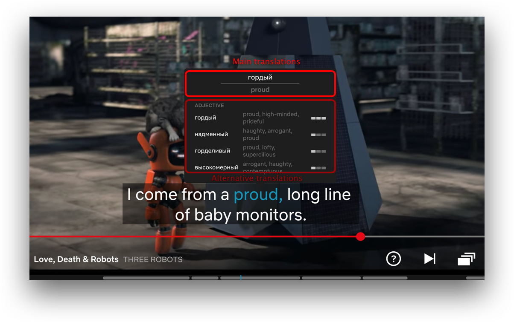
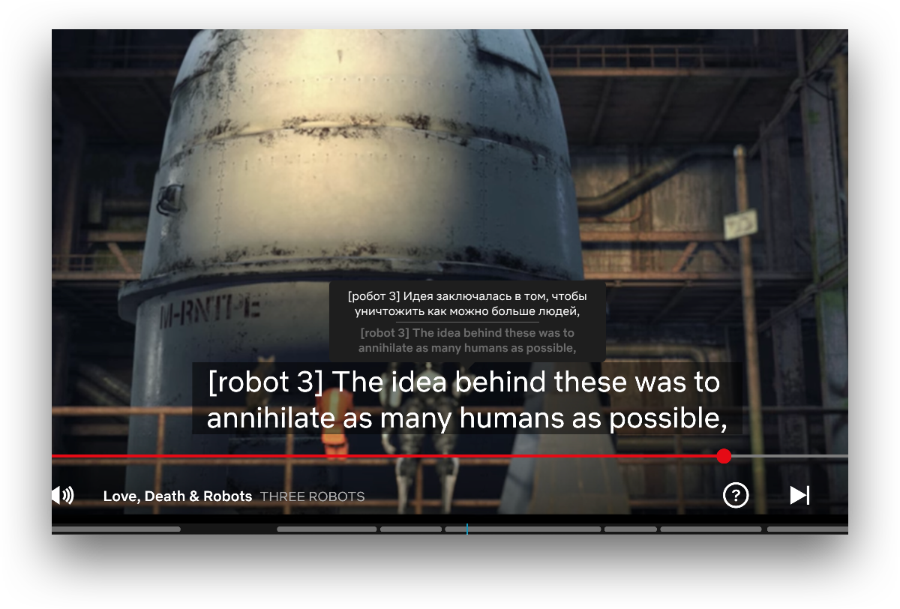
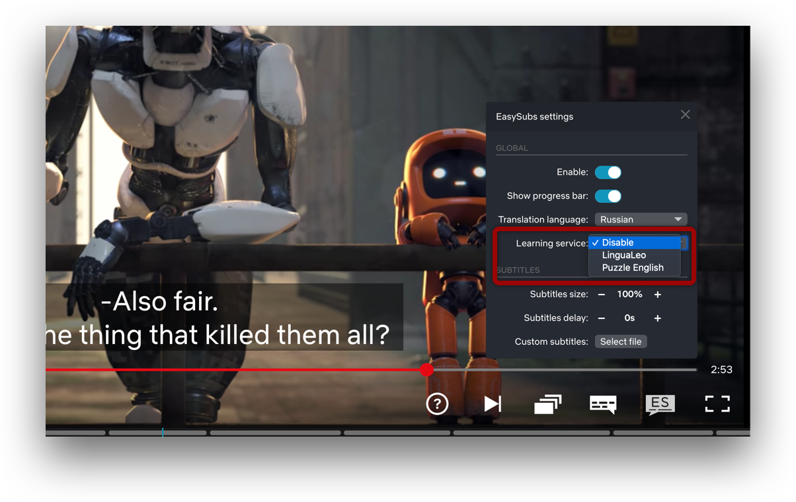
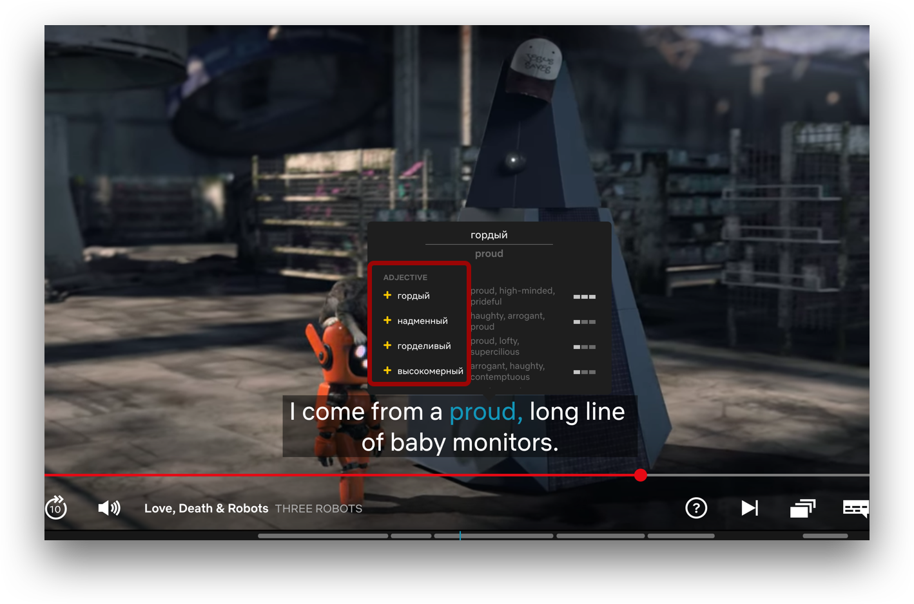
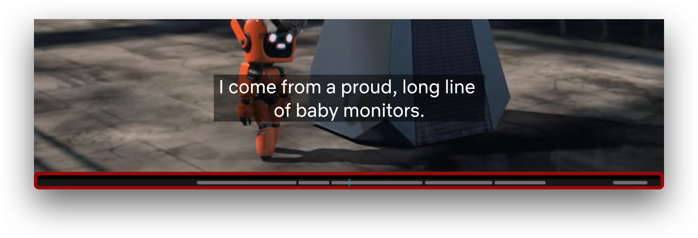
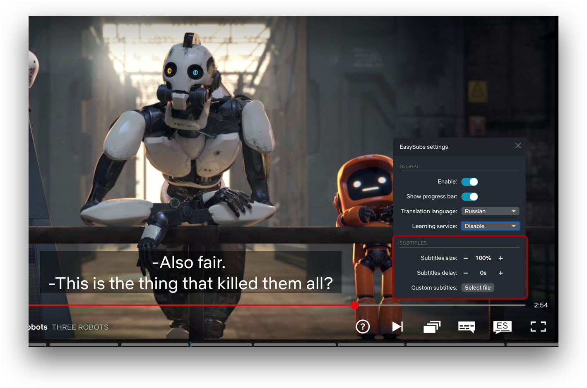

  

  <h2 align="center">Изучаем языки с удовольствием 🎉</h2>

Расширение для Chrome, помогающее в изучении языков с помощью просмотра сериалов и фильмов.

## Установка

Релизная версия скоро будет доступна в Chrome Web Store.  
Пока вы можете установить дев весрию:

1. Скачайте и разархивитруйте [текущий репозиторий](https://github.com/Nitrino/easysubs/archive/master.zip)
2. Откройте страницу расширений в Chrome `chrome://extensions/`
3. Включите режим разработчика
4. Нажмите на кнопку `Загрузить распакованное расширение` и выберите папку `dist`

Теперь можете использовать как обычное расширение.  
Для обновления потребуется заново скачать и установить новую версию.

## Возможности

### Интеграция с множеством видео сервисов

Список сервисов будет расширяться по запросам пользователей.
Для корректной работы у вас должна быть подписка на используемые сервисы.

**Сейчас поддерживаются:**

- [Youtube (videos and originals)](https://www.youtube.com)
- [Netflix](https://www.netflix.com)
- [KinoPub](https://kino.pub)
- [English With Fun](https://english-with-fun.com)

### Перевод слова и полного субтитра

Просто наведите на слово, которое хотите перевести. Видео автоматически остановится и воспроизведется когда уберёте курсор с субтитров.

В попапе перевода слова отображается основной перевод и альтернативные варинаты перевода с частотой использования каждого.

Кликните по субтитру для перевода всего текста.

### Экспорт слов в сервисы изучения языка

Список сервисов будет расширяться по запросам пользователей.

**Сейчас поддерживаются:**

- [LinguaLeo](https://lingualeo.com),
- [Puzzle English](https://puzzle-english.com)

Для работы экспорта требуется авторизоваться в сервисах изучения языка в том же браузере. Нужный сервис выбирается в настройках расширения.

После этого в попапе перевода слова появится кнопка ➕(плюс) возле вариантов перевода.

### Перемотка к предыдущему и следующему субтитру

Для перемотки к предыдущему субтитру нажмите на клавиатуре ⬅️ стрелку влево.  
Для перемотки к следующему субтитру нажмите на клавиатуре ➡️ стрелку вправо.

Перемотка работает только если предыдущий/следующий субтитр ближе чем 5 секунд от текущего. Иначе перематывается на 5 секунд.
Для принудительной перемотки к субтитру нажмите `alt + стрелка`.

### Прогресс бар субтитров

Для упрощения навигации по субтитрам внизу влеера отображается прогресс бар субтитров.
Можно кликнуть по прогресс бару для перемотки к нужной точке.

### Настройка отображения и пользовательские субтитры

Расширение позволяет настраивать размер и задержку субтитров.  
По умолчанию шаг задержки субтитров 0.25 секунды  
`alt + клик по ➕ или ➖ кнопкап` изменяет задержку субтитров на 1 секунду.  
`shift + клик по ➕ или ➖ кнопкап` изменяет задержку субтитров на 5 секунду.

Если на сервисе нет нужных субтитров, расширение позволяет загрузить сторонние субтитры, поддерживаеся `srt` и `vtt` форматы.

### Дополнительные возможности

- Отображение всех аудио дорожек и субтитров на нетфликсе независимо от региона.

## Contributing

Мы открыты к помощи комьюнити.
Для репорта бага или предложения фичи, создайте [задачу](https://github.com/Nitrino/easysubs/issues) и подробно опишите вопрос.  
Вы так же можете реализовать желаемую фичу и прислать [пулл реквест](https://github.com/Nitrino/easysubs/pulls). Рекомендуем перед реализацией сначала обсудить фичу, так как она может быть не принята или реализована иначе.
