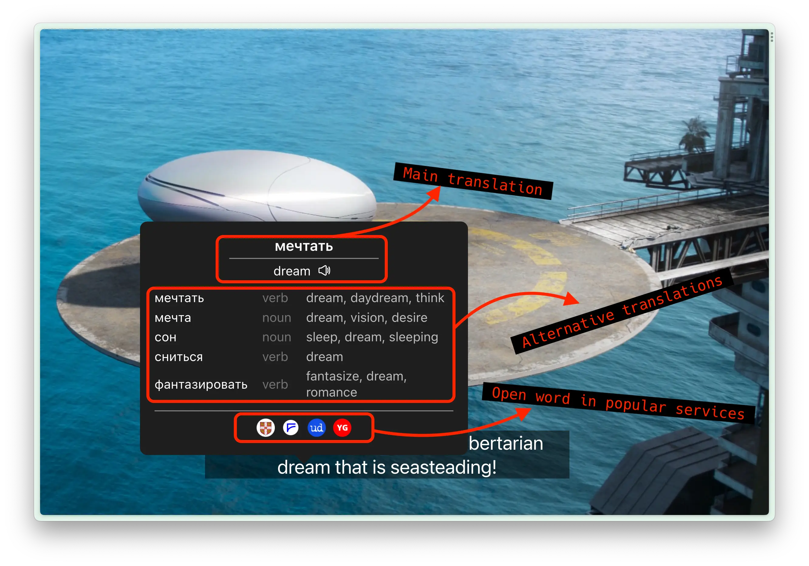
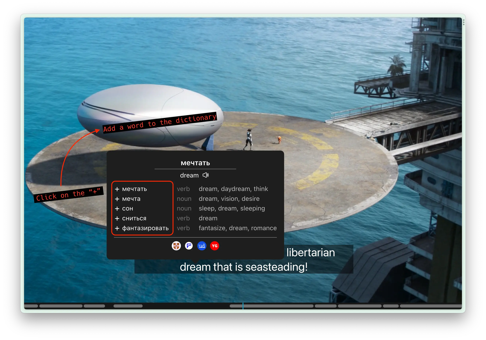
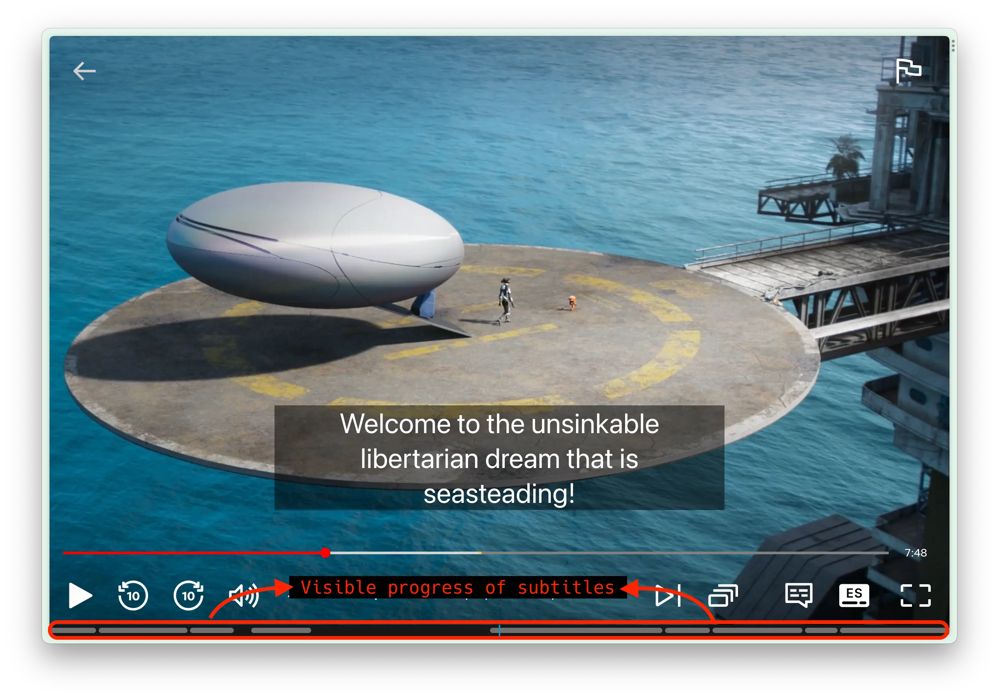
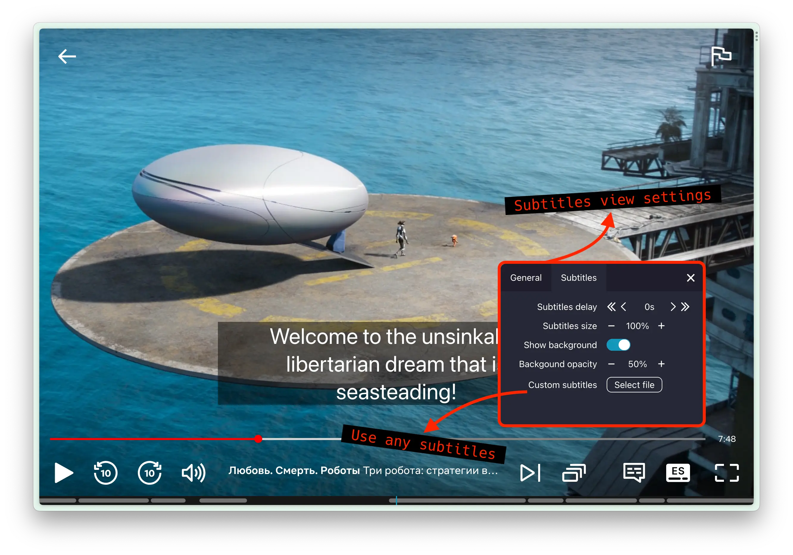

  

  <h2 align="center">Learn languages with fun 🎉</h2>

Browser extension to learn languages by watching movies and TV shows.

## WARNING

**The master branch contains version 3.0 which is currently under active development.  
You can find the release version in the [v1.0 branch](https://github.com/Nitrino/easysubs/tree/v1.0)**

## Installation

The extension supports Chrome, Firefox, Opera and Yandex. It should also work in other browsers that have WebExtensions API support, but it hasn't been tested yet.

**Release version available on [Chrome Web Store](https://chrome.google.com/webstore/detail/easysubs/ocelmccppkcibiflhhepafdjjomimddf?utm_source=github&utm_medium=social&utm_campaign=github)**

## Build

1. Install node 18+
2. Clone repo `git clone git@github.com:Nitrino/easysubs.git`
3. Go to folder and install dependencies `cd easysubs && npm i`
4. Build extension `npm run build`

## Manual install

1. Download and unzip [latest version](https://github.com/Nitrino/easysubs/releases)
2. Open extensions page in browser:
   - For Chrome: `chrome://extensions/`
   - For Yandex browser: `browser://tune/`
3. Turn on developer mode (for all except Yandex browser)
4. Load unpacked extension:
   - For Chrome and Opera: Click to `Load unpacked` button and select folder
   - For Firefox: Click to `Load temporary Add-on...` button and select folder
   - For Yandex browser: Drag and drop folder to extensions page

## Features

### Integration with multiple video services

The list of services will expand at the request of users.  
To use the plugin, you must have a subscription to the desired service.

**Now supported:**

- [Youtube (videos and originals)](https://www.youtube.com)
- [Netflix](https://www.netflix.com)
- [KinoPub](https://kino.pub)
- [Coursera](https://www.coursera.org)

### Word and full subtitle translation

Simply move the cursor over the word you want to translate. The video will automatically pause and resume when you move the cursor away from the subtitles.  
In the translation pop-up for the word, you can see alternative translations and how often they are used.
Click the subtitles to translate the entire phrase.

### Export words to learning services

The list of services will be extended in response to user requests.

**Now supported:**

- [Anki](https://apps.ankiweb.net/),
- [LinguaLeo](https://lingualeo.com),
- [Puzzle English](https://puzzle-english.com)

To export, you'll need to be logged in to the service you want to use (make sure it's the same browser). Then select the service you want to use in the extension settings.

A ➕(plus) icon will then appear next to the words in the translation, and clicking on it will export the word to the selected service.

### Rewind to previous and next subtitle

Rewind to the previous sentence by pressing ⬅️ (left arrow).  
Rewind to the next sentence by pressing ➡️ (right arrow).
Repeat the current subtitle ⬇ (down arrow).

Rewind only works if the next/previous sentence is less than 5 seconds apart from the current sentence. Otherwise it'll rewinds 5 seconds.  
To force rewinding to the next/previous sentence use `alt (option for macOS) + arrow button`.

### Subtitle progress bar

There is a subtitle progress bar at the bottom of the player to help you navigate between subtitles.  
Click the progress bar to rewind the video to the desired point.

### Subtitle settings and custom subtitles

The extension allows you to customise the appearance, position and delay of subtitles.

You can also upload your own subtitles if they are not available on the video service. ` SRT`` and  `VTT`` formats are supported.

### Additional features

- Show all available audio tracks and subtitles on Netflix regardless of region.

## Contributing

We are open to community help.  
To report a bug or feature offer, create [issue](https://github.com/Nitrino/easysubs/issues) and describe the question in detail.

You can also implement the desired feature and send a [pull request](https://github.com/Nitrino/easysubs/pulls). We recommend discussing the feature in issues tracker before implementation. This will help reduce your time.
